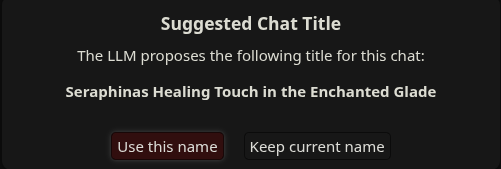
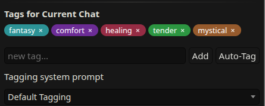
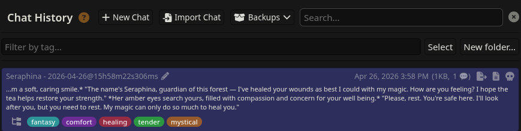
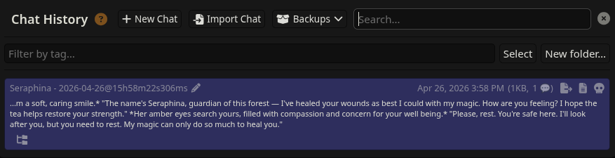
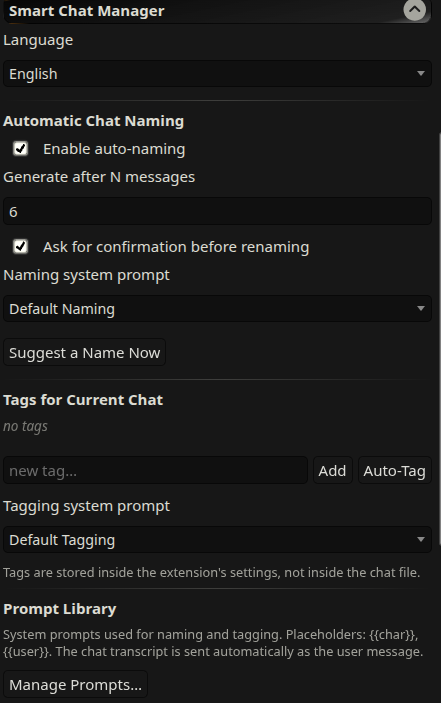
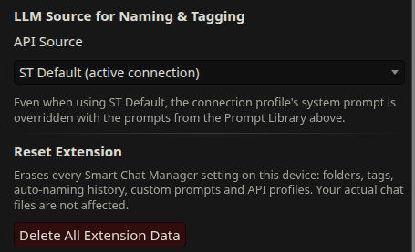

[English](README.md) | [Русский](README_ru.md)

---

# Smart Chat Manager

Расширение для SillyTavern, которое добавляет полноценные инструменты управления чатами туда, где их всегда не хватало. Автоматические заголовки, теги, организация по папкам (внутри одного персонажа) и полностью переработанная панель прошлых чатов с поиском по тегам, массовыми операциями и бейджами. Также включает библиотеку промптов и менеджер API-профилей.

**Важно:** Ваши чаты в безопасности. Расширение не повреждает файлы: все данные (кроме переименования) хранятся отдельно, не затрагивают оригинальный чат, и при удалении расширения всё вернется в исходный вид. (Но бэкапы лишними не бывают!)

**Примечание:** Баги возможны и неизбежны. Если что-то сломалось, проверьте консоль браузера и сообщите об ошибке с деталями, я постараюсь исправить баги.

---

## Возможности

### 1. Авто-названия чатов
Чаты получают заголовки автоматически после достижения порога сообщений (по умолчанию: 6). LLM предложит название, включающее `{{char}}`, а вы сможете принять или отклонить его через подтверждающее окно. Название всегда можно изменить позже.

### 2. Система тегов
Маркируйте чаты вручную или нажмите кнопку **Auto-Tag**, чтобы LLM предложила 3-5 ключевых слов. Теги привязаны к имени файла чата в настройках расширения, поэтому ваши `.jsonl` файлы остаются нетронутыми.

### 3. Система папок
Организуйте чаты в папки, которые отображаются как сворачиваемые группы в списке историй:
- **Вложенные папки:** Создавайте подпапки любой глубины.
- **Кнопка перемещения в строке:** Иконка папки у каждого чата для быстрого переноса.
- **Массовое перемещение:** Выберите несколько чатов и переместите их одним махом.
- **Умное ветвление:** При создании ветки (Branch) расширение предложит упорядочить её: переместить в папку родителя, создать новую подпапку или оставить в корне.
- **Быстрое создание:** Кнопка «плюс» прямо в заголовке папки для мгновенного создания подпапки.

### 4. Обновленный интерфейс прошлых чатов
Расширение встраивает новые элементы управления в стандартное окно "Manage Chat Files":
- **Поиск по тегам** — фильтрация чатов по ключевым словам (логика "И").
- **Цветные бейджи тегов** — отображаются под названием каждого чата.
- **Группировка по папкам** — секции с возможностью сворачивания.
- **Режим массового выбора** — кнопка "Select" включает чекбоксы для групповых операций.
- **Новая папка** — быстрое создание корневых папок прямо из списка.

### 5. Библиотека промптов
Управляйте системными промптами для именования и тегирования в одном месте:
- В комплекте идут дефолтные промпты: **Default Naming** и **Default Tagging**.
- Промпты разделены по типам, чтобы отображаться только в нужных меню.
- Удобный редактор для создания, изменения и удаления.
- Встроенные промпты нельзя удалить, но можно в любой момент сбросить до заводских.
- Поддержка плейсхолдеров `{{char}}` и `{{user}}`. История чата передается автоматически.

### 6. Менеджер API-профилей
Сохраняйте сколько угодно OpenAI-совместимых профилей или используйте текущее подключение. Для каждого профиля можно настроить имя, URL, ключ и модель:
- Выбирайте активный профиль вручную или включите **Rotate**, чтобы расширение переключало их по кругу при каждом запросе.
- Два формата запросов:
  - **Chat Completion** — стандартный массив сообщений (`system` + `user`).
  - **Text Completion** — единая строка для старых эндпоинтов `/completions`.
- Автоматическая миграция настроек при первом запуске, если вы уже пользовались расширением ранее.

### 7. Локализация (EN / RU)
Полный перевод на русский и английский языки. Переключается в настройках «на лету» без перезагрузки страницы.

### 8. Поддержка мобильных устройств
Интерфейс папок адаптирован для телефонов. Области нажатия (tap targets) не менее 32px, а кнопки панелей корректно переносятся на узких экранах.

---

## Установка

В SillyTavern перейдите в **Extensions → Install extension** и вставьте URL этого репозитория.

## Известные ограничения и нюансы

- **Ошибки LLM** (сеть, HTTP-ошибки, некорректные ответы) выводятся в виде уведомлений Toastr. Расширение помечает чат как «попытка именования была», чтобы не надоедать при каждой ошибке. Используйте **Suggest a Name Now** для повторной попытки вручную.
- **Данные тегов и папок** хранятся в настройках расширения ST. Они переживут перезагрузки и смену персонажей, но если вы вручную удалите файл настроек расширения (`settings.json`), данные будут потеряны.
- **Запрос при ветвлении** срабатывает один раз. Если вы отмените выбор, расширение спросит снова при следующем открытии этой ветки. Если выберете «Оставить вне папок», вопрос больше не появится.
- **Глубина папок** не ограничена программно, но на мобильных устройствах интерфейс может стать тесным после 3-4 уровня вложенности.

---

## Лицензия

MIT.
